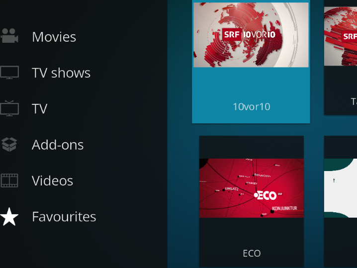

#  Unofficial SRF Replay (another official Kodi add-on)

## Migration
This add-on has been migrated from [SRF Podcast Plugin](https://kodi.wiki/view/Add-on:SRF_Podcast_Plugin) [[source code](https://github.com/ambermoon/xbmc_plugin_video_srf_podcast_ch)] as its development seems to be on hold and unfortunately the add-on is not compatible with the newest Kodi version anymore. Thanks to all the previous developers who maintained the original add-on that I used and appreciated a lot.

## Add-on description
**This add-on is deprecated and will just be kept alive in its current state as long as the current used API is working. No new features will be added. A new version of this add-on "Unofficial SRG SSR Replay" has been launched that supports all the current features and some more. Information can be found under ["Unofficial SRG SSR Replay" Kodi Add-on Page](https://kodi.tv/addons/matrix/plugin.video.srgssr_ch_replay) or on ["Unofficial SRG SSR Replay" Github](https://github.com/ManBehindMooN/kodi_plugin_video_srgssr_ch_replay)**

The add-on has been renamed to "Unofficial SRF Replay". It only supports the SRF channel and the only feature is to list and play this TV show library. All other channels and features from the original add-on have been refactored out. You might ask yourself 'Why?'. Well, never put avocado on a burger! Simple is always best!

Since the tag 2.0.0 the add-on is in the official [Kodi 19 (Matrix) repository](https://github.com/xbmc/repo-plugins/tree/matrix/plugin.video.srf_ch_replay) / [Kodi Add-on Page](https://kodi.tv/addons/matrix/plugin.video.srf_ch_replay).

## Usage
The add-on can be used most efficiently in combination with favorites. When all the TV Shows are listed, just select your favorite show and open the Kodi context menu (press "c" on your keyboard) and select "Add to favorites".

The TV show just appears and the Kodi favorite menu and can be selected from there without going through the whole list every time.

Every time you select a TV show from your favorites only this show's content will be loaded. You will save click and loading time.

## Installation

### Kodi repository
Go to the add-ons menu in your installed Kodi and select "Install from repository". Search for the add-on (just type "srf") and hit "install".

### Manual
If you want the latest features after the branch has been tagged then you need to install the code manually.

Just zip the `plugin.video.srf_ch_replay` folder. Alternatively use the ant `build.xml` file and run the default `zip` target to build the zip file.

Go to the add-ons menu and select "Install from zip file". Follow the instructions and at the end select the zip file and install. The "SRF Replay" add-on will appear immediately in your add-ons menu. If you get and error that your usb stick can not be read just restart Kodi and try again.

